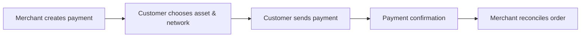

<a href="README.zh-CN.md">简体中文</a> · <a href="https://www.jangopay.org/">Website</a> · <a href="mailto:contact@jangopay.org">Contact</a>

# JangoPay Documentation

**From your first payment link to a connected merchant workflow.**

This hub introduces JangoPay’s public product capabilities and helps merchants plan an integration. English and Simplified Chinese versions follow the same structure.

## Choose your starting point

| Guide | Read this when… |
| :--- | :--- |
| [Getting started](docs/en/getting-started.md) | You want to receive your first payment with a payment link. |
| [Product overview](docs/en/product-overview.md) | You want to understand the six merchant product areas. |
| [Business scenarios](docs/en/business-scenarios.md) | You are choosing a workflow for your online business. |
| [Integration checklist](docs/en/integration-checklist.md) | You are preparing an API/Webhook integration. |

## The payment journey

## Documentation status

These are product guides and integration planning materials based on the JangoPay website, **not a production API reference**. Exact endpoints, request fields, status values, signature verification and SDKs must be confirmed against the current official integration documentation before implementation.

For workflow recipes, see [jangopay-examples](https://github.com/jangopay/jangopay-examples).

## Help & contributions

[Website](https://www.jangopay.org/) · [简体中文](README.zh-CN.md) · [Contact](mailto:contact@jangopay.org)

Use issues for documentation corrections and general questions. **Never include private keys, API keys, customer data or sensitive transaction information in an issue.**
