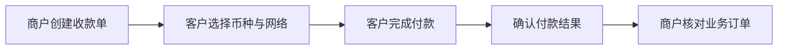

<a href="README.md">English</a> · <a href="https://www.jangopay.org/">Website</a> · <a href="mailto:contact@jangopay.org">Contact</a>

# JangoPay 文档中心

**从第一个收款链接，到连接业务系统的商户支付流程。**

本仓库介绍官网公开的产品能力，帮助商户规划接入方式。中文与英文采用相同目录结构，方便查阅和维护。

## 从你需要的内容开始

| 指南 | 适合什么阶段 |
| :--- | :--- |
| [快速开始](docs/zh-CN/getting-started.md) | 希望通过收款链接完成第一笔付款。 |
| [产品能力](docs/zh-CN/product-overview.md) | 了解六个商户产品模块。 |
| [业务场景](docs/zh-CN/business-scenarios.md) | 为在线业务选择合适的收款流程。 |
| [接入检查清单](docs/zh-CN/integration-checklist.md) | 准备 API 与 Webhook 接入。 |

## 一笔付款如何完成

## 文档范围

这些内容基于 JangoPay 官网，属于产品指南和接入规划资料，**不是正式生产 API 文档**。实施前必须核实当前正式接口地址、请求字段、状态枚举、验签方式与 SDK。

流程模板请查看 [jangopay-examples](https://github.com/jangopay/jangopay-examples)。

## 联系与参与

[官网](https://www.jangopay.org/) · [English](README.md) · [联系团队](mailto:contact@jangopay.org)

欢迎通过 Issue 提交文档纠错与一般问题。**不要在公开 Issue 中填写私钥、API 密钥、客户资料或敏感交易信息。**
